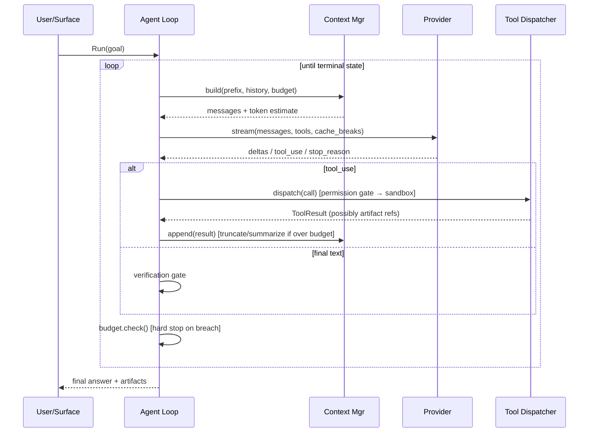

# Architecture

> TL;DR: One process, one thread-owning event loop, five layers (transport → provider → session → agent → surface) communicating through typed events on an append-only log; everything extensible attaches to the tool registry or the event bus, never to the loop itself.

## Process model

Single process. No daemon, no server, no IPC in the core path.

| Component | Threading | Why |
|---|---|---|
| Event loop / agent loop | 1 dedicated thread | Serializes all state mutation; no locks in the loop |
| Provider HTTP client | 1 I/O thread per in-flight request (or async pool) | Streaming SSE must not block the loop |
| Tool executors (bash, MCP stdio, subprocesses) | Worker pool, N = min(8, hw_concurrency) | Blocking syscalls; cancellation via `std::stop_token` + process kill |
| Subagents | Same as tools: worker threads, each owning an `AgentSession` | Isolation by construction; no shared mutable session state |
| TUI renderer | Loop thread, damage-tracked, ≤60 Hz coalesced | Rendering reads a snapshot; never mutates session state |
| MCP stdio servers | Child process + 2 pipes, dedicated reader thread each | Server can block/spew; must not stall the loop |

Rationale: coroutine-everywhere buys nothing here and costs debuggability. The concurrency that actually exists is (a) streaming a response, (b) running N tools/subagents, (c) rendering. Those are three concerns; threads + one event loop express them directly.

## Layers

```
┌───────────────────────────────────────────────────────────┐
│ 5. SURFACE      TUI · headless JSON · exec · ACP          │
├───────────────────────────────────────────────────────────┤
│ 4. AGENT        loop · planning · subagent fan-out        │
├───────────────────────────────────────────────────────────┤
│ 3. SESSION      context manager · compaction · memory ·   │
│                 todo · event log (append-only JSONL)      │
├───────────────────────────────────────────────────────────┤
│ 2. TOOLING      registry · permissions · hooks · skills · │
│                 MCP client · sandbox                      │
├───────────────────────────────────────────────────────────┤
│ 1b. LUA         VM · bindings · extension loader          │
├───────────────────────────────────────────────────────────┤
│ 1. PROVIDER     provider adapters · streaming · retries · │
│                 token accounting · prompt cache layout    │
└───────────────────────────────────────────────────────────┘
```

Dependency rule: **layers point down only.** Surface → Agent → Session → Tooling → Provider. A lower layer never references a higher one; it emits events and returns values. This is what makes headless mode, subagents, and testing cheap — they're all just different drivers of layer 4.

The Lua layer is a **runtime primitive beside the provider**, not a peer of the agent. Lua reaches upward only through the injected `mcode` API; the agent never calls into Lua directly. It publishes events and dispatches tools through the registries, which is exactly what keeps the agent unaware that extensions exist (`18`, `19`).

## Core data structures

| Type | Role | Notes |
|---|---|---|
| `Event` | The only thing that mutates state | Closed tagged union: `kind` + `seq` + `ts` + payload (`20`) |
| `EventBus` | Per-kind subscriber lists, sync dispatch on the loop thread | Depth cap + pending deque for reentrancy (`20`) |
| `EventLog` | Append-only JSONL, one file per session | Source of truth. State = fold(events). Flush per event |
| `SessionState` | Derived, in-memory projection of the log | Rebuildable; never authoritative |
| `Message` | Provider-neutral message | Role + content blocks (text, tool_use, tool_result, image) |
| `ToolDef` | name, description, JSON schema, permission class | One registry entry per tool, whatever its origin |
| `ToolSource` | Where tools come from: builtin, Lua, MCP | **The extensibility boundary** — the agent sees only `ToolDef` (`06`, `19`) |
| `ToolResult` | `std::expected`-shaped: content blocks + `isError` + metadata | Honest error flags (`06`) |
| `Budget` | turns, tokens, wall-clock, cost, subagent count | Checked before every model call and tool dispatch |
| `ArtifactRef` | path + sha + mime + size | Content lives on disk, never in context |
| `LuaVm` | One `lua_State`, allocator-backed, JIT-off by default | Owns extensions; never shared across threads (`17`) |

Why the event log is the source of truth: it gives replay, crash recovery, trajectory export for evals, audit, and undo (checkpoint = event index) for free. It is also the cheapest possible persistence — one append per event, no schema migration.

## Control flow: one turn



**`04` §The loop state machine is the single source of truth for loop states and terminal conditions.** In brief: the loop exits on `Completed`, `Handoff` (budget or ambiguity — never a silent `Failed` on budget), `UserAborted`, or `UnrecoverableError`, with `AwaitingUser`/`AwaitingVerification` as *suspended* states that resume rather than terminate. `03` and the surface layer reference this; they do not restate it.

## The tool registry (the extension seam)

Everything callable is one `ToolDef` in one registry, fed by pluggable **`ToolSource`s**:

```cpp
class ToolSource {
public:
  virtual ~ToolSource() = default;
  virtual std::vector<ToolSpec> tools() const = 0;
  virtual result<ToolResult> call(std::string_view name, const json& args) = 0;
};
```

`ToolSource` is the single boundary the agent is allowed to know about. `BuiltinToolSource`, `LuaToolSource`, and `McpToolSource` are interchangeable behind it, and the agent cannot distinguish them — that is the property that lets the ecosystem grow without touching the core (`19`, `23`).

| Origin | Registered at | Namespacing | Permission class |
|---|---|---|---|
| Core tools | Compile time | `read`, `edit`, `write`, `glob`, `grep`, `bash`, `ask_user`, `tool_search` (`06` §Core tool set — canonical) | per-tool, static |
| Lua extension tools | Runtime, on extension load — **including first-party** | `<ext>__<tool>` (first-party tools keep bare names, e.g. `todo`, `web_search`) | declared in `ext.toml`, clamped by config (`19`, `23`) |
| MCP tools | Runtime, on connect | `mcp__<server>__<tool>` | declared by server, clamped by config (`07`) |
| Skill scripts | **Not tools** — a skill body instructs the model to call `bash` (`08`) | — | `exec` via `bash` |

Registry invariants:
- **`06` §Core tool set is the single source of truth for the built-in tool list.** Other docs reference it; none restate it.
- Names are unique and collision-checked at registration (MCP name collisions are real: `06`).
- Every tool declares a **permission class**: `read` | `write` | `exec` | `net` | `spawn`. Permission policy is a function of class + path/argv, not of tool identity.
- Schemas are immutable after registration; the rendered tool block is cached and its byte-stability is asserted (prompt-cache correctness).
- Tool count is *budgeted*. Over a threshold, tools move behind `tool_search` deferred loading (`06`).
- Registration is **atomic per source**: a source that fails to load contributes zero tools, never a partial set.

## Extension model

**Luau is the plugin ABI.** There is no C++ plugin interface, no `dlopen`, and no hand-maintained C ABI. The C++ core exposes a small, stable, versioned API to Luau; everything higher-level lives in Luau.

| Mechanism | Unit | Discovery | Cost |
|---|---|---|---|
| **Lua extension** | directory with `ext.toml` + `init.luau` | filesystem scan of user/project roots, trust-gated | ~0.5 MB VM once; ~0 ms per extension when `init.luau` only registers (`19`) |
| **Skill** | directory with `SKILL.md` | filesystem scan, precedence-ordered | ~30 tokens in prompt until invoked (`08`) |
| **MCP server** | process (stdio) or URL (HTTP) | config + `server/discover` | process spawn; schema tokens (`07`) |
| **Hook** | Lua function via `mcode.on` | registered at extension load | one `pcall` per event (`20`) |
| **Provider** | C++ adapter | compile time (one file) | zero at runtime |

Extensions add tools, commands, hooks, context, and skills — all through the same `mcode` API, landing in the same registries as the built-ins. **The dispatch path cannot tell where a tool came from**, which is the property that keeps the core small while the ecosystem grows. Provenance is still recorded and surfaced to the *user* (`23`), never hidden from them.

Two deliberate omissions:

- **No C++ plugin ABI.** Version-skewed C++ ABIs are a maintenance tax and a crash surface. Lua is versionable, writable without a compiler, and reloadable.
- **The extension VM is a capability boundary, not an OS sandbox.** It removes `io`/`package`, most of `os`/`debug`, bytecode, and `_G` writes, so an extension reaches the host only through the API — but it runs in-process and does not survive a VM engine bug. Untrusted extensions do not run in-process at all (`12`).

Details: `18` (API surface), `19` (lifecycle and discovery), `20` (event delivery).

## Context manager

Owns: prompt assembly, token accounting, compaction, truncation, artifact spillover, cache-breakpoint placement. Interface is narrow — `build()` and `append()` — because it's the piece most likely to be rewritten as evidence changes.

Invariants:
- System prompt + tool block are byte-stable across turns in a session (cache hit).
- History is append-only between compactions.
- Every tool result is truncated at a per-tool cap with the full text spilled to an artifact.
- Compaction produces `{summary, pinned_facts[], decisions[], open_questions[]}` and preserves artifact references. Details: `05-context-engineering.md`.

## Persistence layout

```
.mcode/
├── sessions/<session-id>.jsonl     # append-only event log (source of truth)
├── artifacts/<run-id>/…            # large tool outputs, patches, logs
├── extensions/                      # project extensions (inert until trusted) (`19`)
├── skills/                          # project skills
├── memory/                          # MEMORY.md index + topic files (`09`)
├── mcp.json                         # MCP server config
├── config.toml                      # project config
└── index.sqlite                     # FTS5 over sessions + memory (optional)
```

Global equivalents live under `~/.config/mcode/` (XDG) or `%APPDATA%\mcode\` and hold user-scope `AGENTS.md`, `extensions/`, `skills/`, `memory/`, and credentials. Merge order and precedence: `08` (instructions, skills), `09` (memory), `19` (extensions).

## Project structure

Directories stay shallow; every file has one clear responsibility.

```
src/
  core/       agent · context · events · session · workspace
  model/      model_client.hxx · openai_compatible/
  tools/      tool.hxx (ToolDef, ToolSource) · registry · executor · filesystem/ · shell/
  ext/        runtime/ (VM, allocator, interrupt, budget) · bindings/ · api/ · loader/
  skills/     SKILL.md discovery (`08`)
  mcp/        client/ · transport/ · tool_source/
  network/    Asio io_context, Beast HTTP/SSE, egress proxy
  terminal/   renderer, input, theme (`13`)
  config/     TOML loading, precedence, validation
  main.cxx
tests/        core tested independently of the terminal (`16`)
extensions/   first-party Lua extensions (dogfooding)
```

Boundaries that matter more than the tree:

- `core/agent` includes **only** `model_client.hxx`, `context`, `registry`, `events`, `session`. If a change to `mcp/` or `lib/` requires touching `core/agent`, the abstraction is wrong.
- `lib/` and `mcp/` are peers, not layers: both implement `ToolSource` and both subscribe to events.
- `terminal/` is a **subscriber**, never a dependency of anything below it.

## Undo and rollback

The event log restores **conversation**, not **files**. Replaying events does not un-mangle a working tree, so workspace rollback is its own mechanism and a first-class safety feature — a harness whose pitch is verification cannot ship without it.

| Mechanism | When | Behavior |
|---|---|---|
| **Pre-run checkpoint** | Before the first write of any run in a git repo | `git stash create` (a dangling commit, no working-tree change) records the pre-run state. Zero user-visible effect |
| **Per-run rollback** | `/undo`, or on `Handoff` after a failed verification gate | `git checkout <checkpoint> -- .` scoped to files the run touched; untracked files the run created are listed and deleted only on confirmation |
| **Per-edit inverse** | Between checkpoints | Each `edit`/`write` records the exact prior bytes in the event log; `/undo <n>` reverses the last *n* edits in reverse order |
| **Non-git workspace** | Any write in a non-git directory | Write mode requires explicit consent; mcode keeps its own shadow copies under `.mcode/shadow/` (content-addressed) so undo still works |

Rules:

- Rollback **never** touches files the run did not modify. The dirty-worktree protocol in the system prompt (`21`) and this mechanism are the same guarantee from two sides.
- Rollback is recorded as an event, so the log stays a complete history.
- `git` is used when present but is not required; the shadow store is the fallback, not a lesser path.
- Nothing is auto-deleted without confirmation — a rollback that destroys untracked user work is worse than the bug it fixes.

## Failure and recovery

| Failure | Behavior |
|---|---|
| Provider 5xx / rate limit | Exponential backoff + jitter, bounded; then `UnrecoverableError` with partial output preserved |
| Stream breaks mid-response | Re-issue request with same prefix; if the provider is non-idempotent, surface partial and ask |
| Tool crashes / sandbox kills it | Capture exit code + stderr as a normal `ToolResult` with `isError`; the model sees it and adapts |
| MCP server dies | Mark tools unavailable, emit notice, continue session; optional restart with backoff |
| Process killed (Ctrl-C / OOM) | Event log is already on disk; `mcode resume <session>` replays |
| Compaction fails | Fall back to hard truncation of oldest tool results, preserving pinned facts; never silently drop the goal |

## What is deliberately not abstracted

- **No model abstraction beyond a small provider trait.** Providers differ in tool-call format and streaming shape; normalizing them into a fake universal API leaks everywhere. Instead: a thin adapter per provider that emits our `Message`/delta types, and per-provider quirks live in that file (`15`).
- **No agent framework.** No graph, no chain, no node types. The loop is a function with a switch.
- **No DI container / no service locator.** Explicit construction in `main`, explicit parameters. Testability comes from narrow interfaces (provider, clock, filesystem, process spawner), not from injection magic.
- **No vector store.** Agentic search first; FTS5 if we ever need it.

## Open questions

- Thread-per-MCP-server vs a shared asio pool: does the thread cost matter at 10+ servers? Measure before optimizing.
- Is `EventLog`-as-truth fast enough for very long sessions (100k+ events) without an index, or do we need periodic snapshots? Snapshot format is easy; trigger threshold is unknown.
- Headless `exec` and TUI share the loop but not the surface — should the surface be an event subscriber, or should the loop call into it? Subscriber keeps layering clean but adds a hop; decide by profiling the delta path.

## Sources

- https://www.anthropic.com/engineering/building-effective-agents — loop shape, tool-result-as-ground-truth
- https://martinfowler.com/articles/harness-engineering.html — guides (feedforward) vs sensors (feedback); computational vs inferential checks
- https://learn.microsoft.com/en-us/agent-framework/concepts/harness — reference component decomposition for a harness
- https://github.com/modelcontextprotocol/modelcontextprotocol/blob/main/docs/docs/2026-07-28/learn/architecture.mdx — MCP host/client/server layering, data vs transport layer
- https://learn.microsoft.com/en-us/windows/console/creating-a-pseudoconsole-session — ConPTY requires dedicated synchronous reader/writer threads
- Research docs `02`, `04`, `05`, `06`, `12`, `13`, `14` (each carries its own primary sources)
