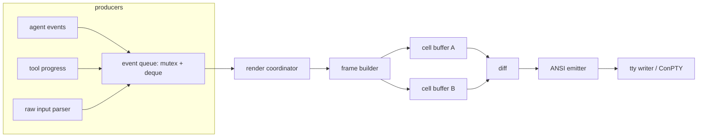

# CLI & TUI Design

> TL;DR: Ship an inline-first hybrid renderer — custom ANSI-only C++23 core with double-buffered cell diffing, a bounded live region at the bottom, and committed transcript lines in native scrollback; no TUI library dependency.

## State of the field

### Libraries compared

| Library | Lang | Deps | Binary/size notes | Unicode width | Windows | Rendering model | Verdict for mcode |
|---|---|---|---|---|---|---|---|
| FTXUI | C++ | none (stdlib + platform APIs; pthread dropped in 7.x) | amalgamated single-header exists; static size moderate [UNVERIFIED — measure] | decent, grapheme gaps | yes | retained DOM, full repaint per frame into `Screen`, then emit | Best C++ library option, but its retained-DOM/event-loop model fights a streaming transcript |
| notcurses | C | libunistring + terminfo core; FFmpeg/OIIO optional | static footprint "larger than ncurses"; media deps "dwarf both" | central to design (grapheme clusters) | partial | planes/piles compositor, damage-based raster | Overkill; wrong deps profile |
| ncurses | C | libncursesw/libtinfo | smallest | per-codepoint `wcwidth` | poor (pdcurses fork needed) | virtual screen + `doupdate()` optimizer (line hashing, scroll detection) | Wrong era of API; no truecolor-first design |
| libvaxis | Zig | none | n/a (Zig, not linkable C++ pragmatically) | grapheme-aware, capability query not terminfo | yes | immediate-mode draw + double-buffer diff | Best API design reference; can't use from C++ |
| ratatui | Rust | crossterm | n/a (reference only) | unicode-width crate | yes (crossterm) | two `Buffer`s of `Cell`; diff previous vs current; write changed cells only | Steal the buffer-diff architecture wholesale |
| Bubble Tea | Go | Go runtime | n/a | go-runewidth family | yes | Elm-architecture MVU, high-performance renderer, color downsampling | Design inspiration for event model, not code |
| Textual | Python | Python runtime | n/a | rich/wcwidth | yes | widget tree + compositor | Inspiration only; heavy runtime |
| ANSI-only custom | C++23 | none | smallest — only what you emit | your policy | ConPTY + VT | yours | **Chosen** |

Evidence: FTXUI "no dependencies" claim and C++17 amalgamated build (github.com/ArthurSonzogni/FTXUI, arthursonzogni.github.io/FTXUI/installation_amalgamated.html). notcurses core requirements = terminfo + libunistring, optional media backends (github.com/dankamongmen/notcurses, doc/HACKING.md). ncurses optimizer internals (invisible-island.net/ncurses/hackguide.html). ratatui buffer-diff pipeline (ratatui.rs/concepts/rendering/under-the-hood/, docs.rs/ratatui Terminal + Buffer). libvaxis immediate-mode + double-buffer diff + capability query (github.com/rockorager/libvaxis). opencode TUI = Bubble Tea MVU with pages/overlays (github.com/opencode-ai/opencode internal/tui/tui.go). Codex CLI uses ratatui with a **custom terminal backend** (`codex-rs/tui/src/custom_terminal.rs`) and dedicated `diff_render.rs` — even a Rust shop with ratatui available chose to customize the backend for an agent UI.

### Inline vs fullscreen

Claude Code's real-world issue history is the evidence base: alternate-screen mode destroyed scrollback access to conversation history (issue #42670), prompting `CLAUDE_CODE_DISABLE_ALTERNATE_SCREEN` (issue #56881). Fullscreen buys stable repaint, dialogs, mouse; it costs native scrollback, terminal search/selection, and crash-safety of the transcript. Inline buys the document model but makes live-updating regions awkward.

Consensus from the field: **hybrid** — append-only transcript in the main screen buffer, one bounded live region (prompt + current activity) redrawn in place at the bottom. Completed content is committed to scrollback and never repainted. This is what Claude Code converged toward and what Aider does trivially well with pure append-only output (aider.chat/docs/usage.html).

### Rendering facts that matter

- **Buffer diff**: ratatui's documented flow — render everything into a current buffer, diff vs previous, emit only changed cells, swap. Diff saves terminal I/O, not CPU: redrawing at 60fps with an unchanged UI still burns rebuild+compare cost (ratatui discussion #1927). corollary: render on change, not on timer.
- **Synchronized output** `CSI ? 2026 h/l` eliminates flicker/tear on frame commit; queryable via DECRQM (contour spec gist by christianparpart). Wrap every frame in it when supported.
- **Kitty keyboard protocol** `CSI > 1 u` (disambiguate escapes) fixes the Ctrl/Enter/ESC ambiguity mess; pop with `CSI < u` (sw.kovidgoyal.net/kitty/keyboard-protocol/).
- **Windows**: ConPTY **rewrites the input stream** — it translates and can drop extended keyboard sequences, so Kitty keyboard protocol and CSI-u enhancements are not reliably available through it. The Windows input path is legacy VT/console-events only; the `\` + Enter newline fallback (`13` §Input) is therefore the *default* on Windows, not a fallback. Output is unaffected. ConPTY speaks UTF-8 + VT in both directions; VT sequences and UTF-8 chars can split across arbitrary read boundaries — you need an incremental UTF-8 decoder feeding an incremental VT parser (learn.microsoft.com/windows/console/pseudoconsoles; EchoCon sample uses raw `WriteFile` forwarding for this reason). Modern Windows Terminal + ConPTY make VT-first rendering viable; the console-API path is legacy-only. Set the UTF-8 code-page manifest (`24`).
- **macOS**: Terminal.app, iTerm2, and Ghostty are the targets. Width handling differs per terminal (ambiguous-width policy is terminal-specific, not OS-specific), so the policy must be configurable (`MCODE_AMBIGUOUS_WIDTH`) rather than inferred. iTerm2 supports in-band resize; Terminal.app does not — never depend on it.
- **Width is not wcwidth**: codepoint-summed widths break on VS16 (☺️ 1→2 cells), ZWJ sequences, skin-tone modifiers, flags, keycaps. Unicode itself says EAW is "not an off-the-shelf solution" for terminals (unicode.org/reports/tr11); POSIX defines `wcwidth` per-codepoint, not per-grapheme (man7.org). Policy must be: segment graphemes (UAX #29), apply emoji-aware cluster widths, make ambiguous-width configurable, never split a cluster when truncating.
- **Syntax highlighting cost**: tree-sitter incremental parse is fast (tree-sitter-rust: ~6.5ms initial parse of a 2,157-line file, <1ms edits) but **highlight queries are not incremental** — they re-traverse (tree-sitter discussion #1976). Mitigation: query only visible-range ± context margin, cache spans outside it, keep queries structurally local.
- **delta's diff model**: line-level style + within-line "edit inference" to emphasize only the changed fragment of a paired line; `plus-style = syntax auto` (highlight added lines, not removed) is the default because removed-code highlighting reads as noise (github.com/dandavison/delta + manual).

## What works / what doesn't

| Approach | Works | Doesn't |
|---|---|---|
| Append-only (Aider) | zero flicker, perfect scrollback, `--no-pretty` fallback | no live tool progress, no in-place edits |
| Fullscreen (Claude Code fullscreen, opencode) | stable repaint, overlays, mouse | scrollback loss complaints (#42670), renderer-transition bugs, SSH/tmux fragility |
| Hybrid (Claude Code default trend) | transcript persists + live region repaints | needs disciplined commit boundary; resize handling |
| Library TUI in C++ (FTXUI) | fast to prototype | event-loop/DOM model mismatched to streaming output; every frame full DOM rebuild |
| tree-sitter full-file highlight | correctness | query cost scales beyond viewport; 83ms spikes reported on pathological files (issue #4019) |
| `wcwidth()` per codepoint | ASCII/CJK fine | emoji/ZWJ/VS16 misalignment — padding and tables drift |

Numbers found: tree-sitter-rust 6.48ms initial / <1ms incremental (repo README); 60Hz frame = 16.7ms budget; delta default word regex `\w+`.

## Recommended design for mcode

### Architecture: custom ANSI renderer, hybrid inline

No TUI library. One small module (`tui/`), ~3–5k LOC estimated, zero third-party deps. C++23: `std::span`, `std::expected`, `std::format`, `constexpr` tables.

**Terminal layer** (`tty`): raw-mode setup/restore (RAII guard), resize via the `ResizeSource` interface (`24` — `SIGWINCH` on POSIX, `WINDOW_BUFFER_SIZE_EVENT` on Windows, in-band DECSET 2048 as an optional fast path), incremental UTF-8 decoder → VT parser → key/mouse/paste events. Windows backend: ConPTY-aware; enable `ENABLE_VIRTUAL_TERMINAL_PROCESSING` on stdout; same event stream as POSIX. Capability detection at startup: query DECRQM for 2026, probe `COLORTERM`/`TERM` for truecolor, try Kitty keyboard `CSI > 1 u` with timeout, DA1 for feature gating. Cache results; env overrides: `MCODE_TUI=plain` forces the non-TUI line reader (the same path taken when there is no tty), and `NO_COLOR` drops to attributes only. There is **no** `full` mode — the renderer is inline-only by design, so `MCODE_TUI=inline` is accepted as the default rather than switching anything.

**Cell buffer**: `struct Cell { char32_t cp; Style style; uint8_t width; }` in a flat `Vec<Cell>` sized cols×rows. Style = packed fg/bg (truecolor u24 + flag for indexed/named) + attrs byte. Two buffers, swap after flush (ratatui model).

**Frame builder**: pure function `state → buffer`. Rebuilds only the live region + dirty transcript tail; committed lines are written straight to stdout (bypassing buffers) at commit time, so the diff only ever covers the bottom `LIVE_ROWS`. The region's height is dynamic — prompt + status as the floor, grown by the palette and the active rows, capped at 16 and at the terminal height minus one.

**Render loop**: event-driven, not timer-driven.
1. Drain queue; coalesce (max 1 frame per wakeup; spinner ticks are the only timer, 80–120ms interval, skipped when idle).
2. Rebuild live-region cells.
3. Diff vs previous live region (row-granular first: skip identical rows; then cell-level within changed rows).
4. If any change: wrap emit in `CSI ? 2026 h … l` when supported; move cursor once to region top; emit runs of changed cells with SGR deltas tracked (only emit attribute changes when they differ from current pen state).
5. Flush; swap buffers.
Target: <1ms CPU per spinner frame at 100 cols; zero writes when nothing changed.

**Commit protocol**: when a tool/message completes, clear the live region, print the finalized block to scrollback with trailing newline, redraw live region. Crash-safe: transcript is always in the terminal's own buffer; a `SIGKILL` loses at most the live region.

**Streaming markdown**: chunk-oriented. Parse incrementally (commonmark-ish subset: headings, fenced code, lists, bold/italic, inline code). Only the last open block re-renders per token batch; closed blocks are immutable and committed. Fenced code blocks get syntax highlighting **only if** a tree-sitter grammar for the language is already loaded; otherwise plain with punctuation dimmed. Never parse synchronously on the render thread — highlight jobs run on a worker, results applied by version number, stale results dropped.

**Diff rendering**: delta's model, simplified — line-level +/- tinting; for paired -/+ lines within threshold, run word-level (`\w+`-token) LCS and emphasize only changed tokens with a stronger bg. Added lines syntax-highlighted, removed lines plain (delta default rationale). Fold unchanged hunks ≥3 lines with `⋯ +12 lines` expander. No side-by-side in v1 (wrap logic doubles).

**Tool-call UI**: one live row per active tool: spinner glyph + verb + target + elapsed. Spinner frames: braille `⠋⠙⠹⠸⠼⠴⠦⠧⠇⠏` at 80ms. Completion collapses to one committed line: `✓ edit src/main.rs +12 −3 1.2s`. No progress bars — token streams don't have known totals; show counts.

**Status line**: `model ▸ 12.4k tok NN% ▸ $0.031 ▸ 4.2s`, and while a turn runs a trailing `▸ Thinking...  esc to interrupt`. The percentage is `context_used / context_capacity`; capacity `0` means unknown and **omits the percentage** rather than printing a guess. Colour is read off the same integer that is displayed: `warn` from 80%, `error` from 95%. The activity verb is phase-driven — `Thinking` while reasoning streams, `Working` while prose streams, `Running <verb>` while a tool is active, empty when idle — so appearing and clearing move only the status row.

**Scrolling**: the terminal's own scrollback stays the durable transcript; committed rows are printed through the normal commit path and are never erased. On top of that the coordinator retains a bounded copy of what it committed (`SCROLLBACK_MAX_ROWS`, filled after the wrap so the retained rows are byte-identical to the screen) purely so PageUp/PageDown and the wheel can repaint history **inside** the live region. While scrolled the region grows to the full available height, shows the retained rows under a dim `── history (End to return) ──` header, and the prompt is unreachable until the view returns to live. The offset is clamped to the deepest
one that still fills the viewport's body, so a page of history is never blank rows above the
oldest retained row. Scrolling never writes to the terminal — it moves an offset and lets the cell diff repaint — and no destructive clear is ever emitted (`clear_region` uses `CSI 2K` per row; there is no `CSI 2J`, `3J`, `S` or `T` anywhere), so a scroll can never damage the real transcript. Mouse reporting is off by default and enabled only while a turn runs, because a terminal reporting the wheel stops scrolling its own scrollback, which is how history is read.

**Tables/boxes**: box-drawing only for the input box and dialogs; single-line borders `─│╭╮╰╯`, no double lines. Tables in tool output render as aligned columns with dimmed separators, capped at 3 columns before falling back to indent tree.

**Input**: multi-line editor — Enter submits, `\`+Enter inserts a newline (Shift+Enter needs the Kitty protocol, which is not probed and which ConPTY does not reliably carry, so it is not relied on). History is a ring, navigated with ↑/↓. Ghost-text completion is implemented and spliced at the caret. **Bracketed paste is implemented**: `create` writes `CSI ? 2004 h` on both platforms, `tty_decode` produces `key_event::kind::paste` from the `200~`/`201~` markers, and the REPL inserts the payload as content — a multi-line paste is never submitted line by line, which was the bug. `[pasted N lines]` placeholder rendering and OSC 52 clipboard are not implemented.

**Keybindings**: minimal modal set — normal input mode plus the picker overlay. No vim mode. Implemented today: Enter submits (and runs the highlighted picker row when a picker is open), ↑/↓ navigate history or the picker, Tab completes, `\`+Enter inserts a newline instead of submitting (the cross-platform multi-line route — Shift+Enter needs the Kitty protocol, which ConPTY does not reliably carry), Ctrl+R opens a reverse search over the session history in the same picker overlay (Enter inserts the entry into the prompt rather than submitting it; Esc restores the pre-search input), PageUp/PageDown scroll the transcript, End returns to live, Ctrl+C interrupts the turn and returns to the prompt, Ctrl+D at an empty prompt exits, Esc dismisses a picker or interrupts a running turn. Mouse wheel scrolls while reporting is on. A `Ctrl+K` command palette is **not** implemented; the `/` picker is the entry point.

**File mention**: `@` in the input opens a fuzzy picker over the workspace and inserts the chosen **path** (never the file's contents — that would spend the transcript budget on a mention that may never be read). The picker is the same palette widget with a different source, so ranking, filtering and the ghost-text completion behave identically. Matching is three-tier: path prefix, then basename prefix, then subsequence; case-insensitive.

**Session commands.** The built-in slash commands are: `/help`, `/cost`, `/context`, `/model`, `/tools`, `/compact`, `/export`, `/undo`, `/rewind`, `/init`, `/extensions`, `/doctor`, `/mention`, `/exit`.

- `/undo` restores the files the **current run** changed; `/rewind` restores every captured file. Both report the count, and both say so plainly when no snapshot store is configured rather than reporting a zero that reads like success.
- `/init` generates an `AGENTS.md` from what is actually in the repository. It does **not** write a scaffold, and it does not write the file itself: it submits a prompt, the agent explores the workspace and writes the file, so the content comes from what is there rather than from a template. It refuses when an `AGENTS.md` already exists — the file is the user's, and overwriting it would destroy the instructions the agent is meant to follow. `docs/42` is the research the prompt is built from; `docs/08` owns how the file is loaded once written.
- `/extensions` reports the session's extension load: each loaded extension's version, tools and VM memory, then every failure with the loader's own reason, and the count of disabled ones. It reads the load report rather than re-inspecting the live surfaces, so it reports what the loader decided. Before a session exists it says so, because "nothing loaded" and "nothing to read" are different answers.
- `/doctor` reports what is actually loaded: the model, the workspace, the registered tool count with its schema cost in bytes and estimated tokens, the context fill, whether snapshots are available, and the size of the loaded instruction chain. It reports only what this build can observe, and says `unknown` rather than guessing.

**Approval is visible state, not a hidden flag.** The interactive session defaults to permissive (`never`) and prints the boundary on entry — naming the hard-deny floor and `permissions.deny` as what still holds — rather than claiming the mode is safe. A headless run keeps the conservative default and fails closed, because it has neither a human to read the disclaimer nor `/undo`. `--ask` restores prompting and wins over `--yolo`; `--plan` is read-only and is decided ahead of both.

**Session persistence.** Every run writes an append-only JSONL event log under the per-user data directory, in a `sessions/` subdirectory, named by a session id derived from the workspace root so two workspaces do not collide. `--continue` reopens the newest session for the current workspace; `--resume <id>` names one; `--sessions` lists them (id, start time, size) and exits without running a turn. An unknown id is a hard error, never a silent fresh start — a resume that quietly begins a new session is worse than one that fails.

**A resume carries the transcript.** The log records the conversation itself — the user's task, each assistant message, and each tool output — not merely that a tool ran. `restore_transcript` rebuilds `model::message` history from those events and the loop is seeded with it before the turn starts, so a continued session picks up where it left off. The first version of this recorded only tool names and pass/fail flags, so `--continue` restored a sequence number and the model began from an empty history; the log format is the feature. A session written before transcript recording resumes with an empty history and says so, rather than pretending.

**`--worktree` is the cheapest blast-radius limit.** The run happens in a detached git worktree under `<workspace>/.mcode/worktrees/`, so an unattended session cannot touch the user's checkout, and the rollback is `git worktree remove` rather than a snapshot store. It is created before anything resolves the workspace root, so the instruction chain, the tools and the session all point into it. A missing git, or a directory that is not a repository, fails with git's own message rather than a generic one.

**`mcode setup` is a subcommand, not an installer script.** The one-line installers (`install.sh`, `install.ps1`) fetch and verify the binary and then hand off to it, so the interactive part exists once. It is interactive on a terminal and flag-driven otherwise, which means the same binary serves a provisioning script. Colours resolve through the shipped `theme_table`, so the wizard cannot drift from the TUI palette. Verification runs a real turn (`mcode exec --json`) with the key in the child's environment, which proves the descriptor, the credential and the streaming parser agree; the key never reaches disk and never appears in the process arguments.

**The session opens with a header, committed rather than painted.** A startup banner lands in the terminal's own scrollback as the first block, so it does not scroll away with the first turn. It carries the version, the platform, and the approval boundary: a permissive default is only defensible while what still holds is visible, so the "edits run without prompting / the hard-deny floor still applies" notice lives here rather than on stderr before the session, where it scrolled out of sight.

**One flush, and nothing scrolls after a commit.** The opening is a single `flush` and no separate scroll: `commit` already scrolls what it wrote clear of the region, so anything that scrolls afterwards pushes the committed block back off the top. Measured: a `reserve()` that emitted `screen_rows - 1` newlines here did exactly that, because a flush leaves the cursor on the last row and every newline then scrolled — the banner was written and scrolled off in the same breath, and the opening screen read as empty. `flush` likewise reconciles the region's height *before* it commits, because `commit` scrolls by that height: committing first used the taller, stale height and left a blank gap between the answer and the status line that grew with the region's old height. Both are stated as constraints in `40-non-obvious-constraints.md` §118, and both are gated — in-process by the screen model in `tests/tui_test_helpers.hxx` (`test_tui_opening.cxx`, and the `[screen]` case in `test_tui_commit.cxx`) and against a real console by `tools/tui_check/tui_screen.py`.

**The status line distinguishes waiting from working.** Between submitting and the first delta the model is thinking and nothing has arrived, so every content-derived signal is empty. Reporting nothing there left a silent gap that reads as a hang; the turn's own running state fills it, giving `Waiting` before the first token, `Thinking` during reasoning, `Working` while prose streams, and `Running <tool>` during a call, with `esc to interrupt` beside it.

### Theme spec

Named tokens; each resolves per color depth. **Ship the token names and the fallback rule now; choose the actual values during implementation against real terminals.** Pixel-exact hex values for an unrendered UI are unfalsifiable, and they churn the moment anyone sees them on a real screen. The structure below is the durable part.

| Token | Truecolor | ANSI-256 | ANSI-16 | Role |
|---|---|---|---|---|
| `text` | `#d4d4d4` | 253 | default | body |
| `muted` | `#6b6b6b` | 243 | bright-black | timestamps, folds, hints |
| `accent` | `#7aa2f7` | 111 | bright-blue | prompt, links, focus |
| `success` | `#9ece6a` | 114 | green | ✓, additions |
| `warn` | `#e0af68` | 179 | yellow | warnings, token meter |
| `error` | `#f7768e` | 204 | red | ✗, deletions |
| `code.bg` | `#1a1b26` | 234 | black | fenced code bg |
| `diff.add.bg` | `#20303b` | 236 | — (fg green) | added lines |
| `diff.add.emph` | `#2d4f67` | 239 | — (bold) | changed words |
| `diff.del.bg` | `#312734` | 237 | — (fg red) | removed lines |
| `diff.del.emph` | `#4a3247` | 240 | — (bold) | changed words |

Fallback rule: token declares `{truecolor, ansi256, ansi16}` triple; renderer picks deepest supported. If terminal reports no color at all: attributes only (bold for emphasis, no fg changes) — Aider's `--no-pretty` proves this tier is worth keeping. Never downsample per-cell; pick one depth per session.

Spacing/glyph rules:
- Indent: 2 spaces for nested content; block gap = 1 blank line between message groups, 0 within.
- Gutters: diff `+`/`-`/space, tool output `│` in `muted`, 1-char wide, always padded so copy-paste strips predictably.
- No emoji in chrome; status glyphs restricted to `✓ ✗ ⠿ ▸ ⋯ │` (all single-width, no VS16 dependency — deliberately avoids the emoji-width trap).
- Ambiguous-width policy: configurable, default 1. `MCODE_AMBIGUOUS_WIDTH=2` declares that the terminal renders the East Asian Ambiguous glyphs `│`, `─`, `•` and `…` two columns wide; unset, `1`, or any other value means one. The value is clamped to exactly {1, 2} — an unknown value is not an error and is not logged. It is probed once at startup into `capabilities::ambiguous_width`, and the frame builder, the commit wrap and the caret all measure with that one value, so a terminal that renders them two columns wide cannot desynchronise the grid. See `docs/40-non-obvious-constraints.md` 96.
- Every emitted string goes through one width function: grapheme-segment → cluster width → truncate on cluster boundaries, never mid-cluster.

## Traps

- **Timer-driven rendering**: burns CPU rebuilding identical frames (ratatui #1927). Render on event; only the spinner owns a timer.
- **Full-screen repaint per frame in inline mode**: moves the cursor through scrollback and flickers. Only the bounded live region is diffed/repainted.
- **Trusting `wcwidth()` for layout**: emoji/ZWJ/VS16 break alignment; use grapheme-cluster widths with a declared policy.
- **Reading ConPTY output with line-buffered or formatted I/O**: sequences split across reads corrupt state; incremental parser mandatory (Microsoft's own sample forwards raw bytes for this reason).
- **Unconditional synchronized-output**: terminals without 2026 support may visibly lag; gate on DECRQM probe, not on `TERM` pattern matching.
- **Highlighting on the render thread**: tree-sitter queries are not incremental; a pathological file (83ms case) stalls the spinner. Worker + version-stamped results.
- **SGR spam**: emitting full `SGR 0` + attributes per cell instead of pen-delta tracking multiplies byte volume ~5–10× on diffs [UNVERIFIED — measure]; track current pen and emit minimal transitions.
- **Alternate screen by default**: you inherit Claude Code's #42670 class of bug reports. Inline-first, fullscreen opt-in.
- **Unicode version drift**: pin the width tables to one Unicode version and say which; mixed versions across components guarantees mismatched wrapping.

## Open questions

- Exact static binary delta of FTXUI vs custom renderer at `-Os -ffunction-sections` + LTO — measure before rejecting FTXUI for dialogs-only use.
- Does the live-region commit protocol handle terminal resize mid-stream without artifacts? Needs a test matrix across tmux, Windows Terminal, iTerm2, and Terminal.app (`24`).
- OSC 52 clipboard reliability inside tmux/screen without passthrough — may need an escape-sequence wrapper heuristic.
- Minimum viable markdown subset: do we ever need tables inside streamed markdown, or only in tool output?
- Kitty keyboard protocol adoption on Windows Terminal — currently partial [UNVERIFIED]; need feature probe fallback to CSI-u/legacy.

## Sources

- https://github.com/ArthurSonzogni/FTXUI
- https://arthursonzogni.github.io/FTXUI/installation_amalgamated.html
- https://github.com/dankamongmen/notcurses
- https://github.com/dankamongmen/notcurses/blob/master/doc/HACKING.md
- https://invisible-island.net/ncurses/hackguide.html
- https://ratatui.rs/concepts/rendering/under-the-hood/
- https://docs.rs/ratatui/latest/ratatui/struct.Terminal.html
- https://docs.rs/ratatui/latest/ratatui/buffer/struct.Buffer.html
- https://github.com/ratatui/ratatui/discussions/1927
- https://github.com/rockorager/libvaxis
- https://github.com/opencode-ai/opencode/blob/73ee4932/internal/tui/tui.go
- https://github.com/charmbracelet/bubbletea
- https://github.com/openai/codex/blob/main/codex-rs/tui/src/custom_terminal.rs
- https://github.com/openai/codex/blob/main/codex-rs/tui/src/diff_render.rs
- https://github.com/anthropics/claude-code/issues/42670
- https://github.com/anthropics/claude-code/issues/56881
- https://aider.chat/docs/usage.html
- https://aider.chat/docs/config/options.html
- https://github.com/dandavison/delta
- https://github.com/dandavison/delta/blob/main/manual/src/full---help-output.md
- https://learn.microsoft.com/en-us/windows/console/pseudoconsoles
- https://learn.microsoft.com/en-us/windows/console/createpseudoconsole
- https://learn.microsoft.com/en-us/windows/console/console-virtual-terminal-sequences
- https://github.com/microsoft/terminal/blob/main/samples/ConPTY/EchoCon/EchoCon/EchoCon.cpp
- https://sw.kovidgoyal.net/kitty/keyboard-protocol/
- https://gist.github.com/christianparpart/d8a62cc1ab659194337d73e399004036
- https://tree-sitter.github.io/tree-sitter/using-parsers/3-advanced-parsing.html
- https://github.com/tree-sitter/tree-sitter/discussions/1976
- https://github.com/tree-sitter/tree-sitter/issues/4019
- https://github.com/tree-sitter/tree-sitter-rust/blob/master/README.md
- https://unicode.org/reports/tr11/
- https://unicode.org/reports/tr29/tr29-30.html
- https://man7.org/linux/man-pages/man3/wcwidth.3p.html
- https://wcwidth.readthedocs.io/en/latest/api.html
